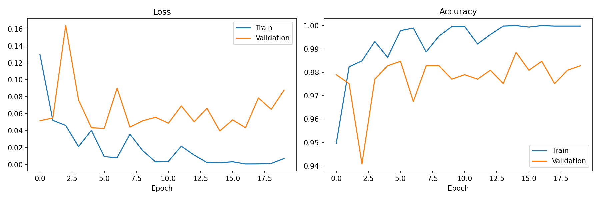
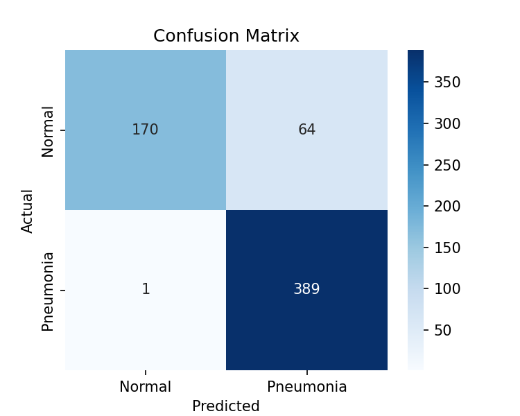
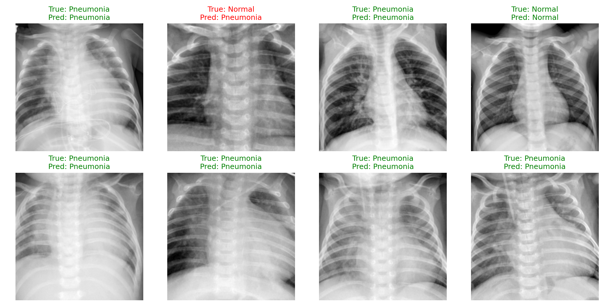

# Chest X-Ray Pneumonia Classification using ResNet18

A binary image classification model that distinguishes normal chest X-rays from pneumonia cases, using transfer learning on a ResNet18 backbone.

## Overview

This project fine-tunes a pretrained ResNet18 (adapted for single-channel grayscale input) to classify chest X-rays as Normal or Pneumonia. It includes a full evaluation pipeline with precision, recall, F1 score, and a confusion matrix — not just raw accuracy.

## Dataset

- **Source:** PneumoniaMNIST (via the MedMNIST package)
- Images resized to 224x224 for ResNet compatibility
- Standard train/validation/test split as provided by MedMNIST

## Model Architecture

- ResNet18, pretrained on ImageNet, first conv layer modified for grayscale (1-channel) input
- Final fully-connected layer replaced for binary classification
- Loss function: Binary Cross-Entropy with Logits
- Optimizer: Adam, learning rate 1e-4
- Trained for 20 epochs on a single GPU (Colab T4)

## Results

| Metric | Value |
|--------|-------|
| Test Accuracy | [insert value] |
| Precision | [insert value] |
| Recall | [insert value] |
| F1 Score | [insert value] |

### Training Curves (Loss & Accuracy)

### Confusion Matrix

### Sample Predictions

## Tech Stack

- Python, PyTorch, Torchvision
- MedMNIST
- scikit-learn (metrics), Seaborn (confusion matrix visualization)

## How to Run

1. Open the notebook in Google Colab
2. Run cells sequentially (GPU runtime recommended)
3. Dataset downloads automatically via the medmnist package

## Author

Aleena Kainat — AI/ML researcher working in applied deep learning and medical image analysis
